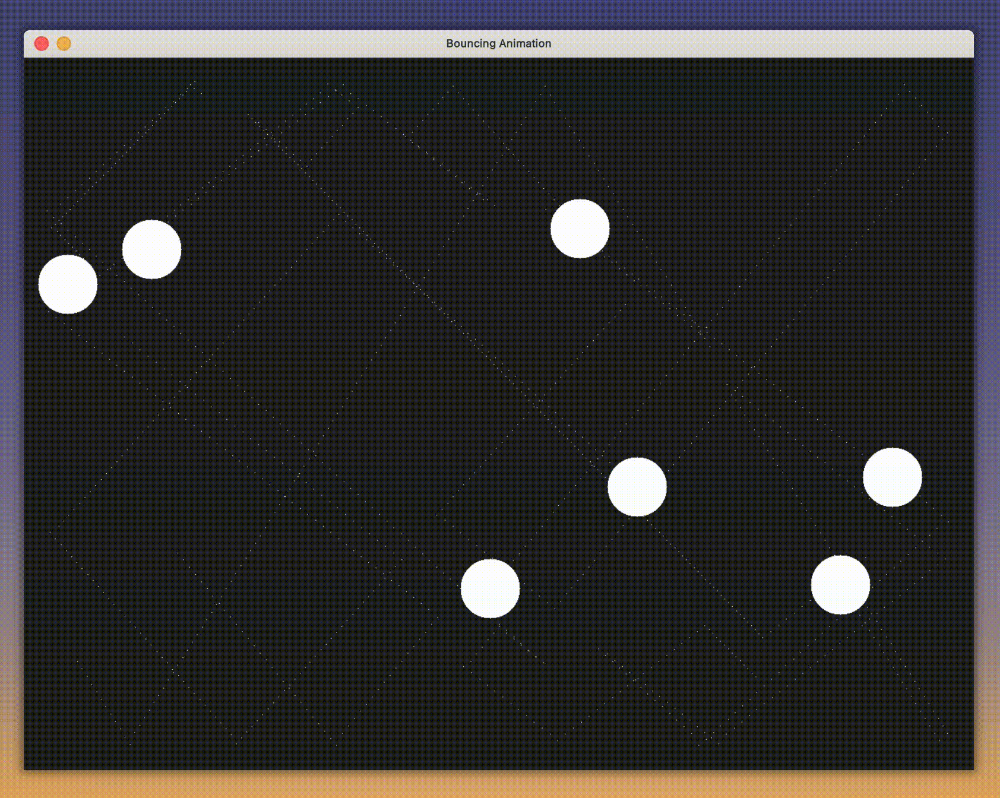

# bounCe

A little experimentation with SDL2 and C, trying out to animate some collision physics, will use it as a base for future SDL2 projects, trying out more complex motion and inertia, gravity etc.

